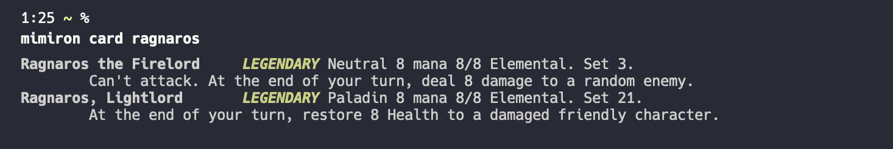
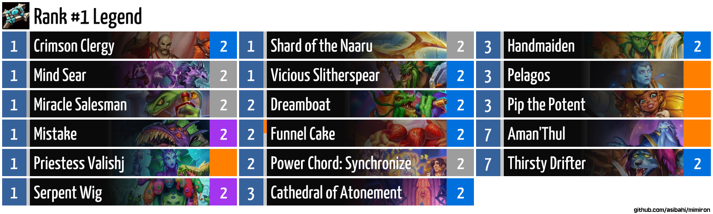

# Mimiron

An overengineered CLI tool and Discord bot to look up Hearthstone cards. It feeds up on the official Blizzard API and therefore, in theory, always works and always has the official, and updated, data for all cards.



The following is a write up about the CLI app. For the discord bot, please go to [The Bot's README.](./mimiron_bot/README.md)

## Installation

You need to have Rust installed on your system. You can then fork this repositry and install the app on your machine with.

```sh
cargo install --path ./mimiron_cli/
```

However, you need your Blizzard API credentials as environment variables under `BLIZZARD_CLIENT_ID` and `BLIZZARD_CLIENT_SECRET`.

## Usage

> **Note on Localization:** All the commands described below support localized output. The default localization is `enUS`. But you can use any of Blizzard's supported locales. Try all the commands with `--locale deDE` for German loczalization, for example, or `-l jaJP` for Japanese.

### Card Lookup

Look up a card:

```sh
mimiron card ragnaros
```

Add image links with `--image` (works with Battlegrounds look ups as well):

```sh
mimiron card ragnaros --image
```


If the text you're looking up includes spaces or apostrophes they need to be in quotation marks (or the shell trips up), or you can escape them:

```sh
mimiron card "Al'Akir"
```

```sh
mimiron card Ace\ Hunter
```

Include card text boxes in search (which is the default mode for Blizzard's API):

```sh
mimiron card ragnaros --text
```


### Deck Lookup

Look up a deck:

```sh
mimiron deck AAECAa0GCOWwBKi2BJfvBO+RBeKkBf3EBc/GBcbHBRCi6AOEnwShtgSktgSWtwT52wS43AS63ASGgwXgpAW7xAW7xwX7+AW4ngbPngbRngYAAQO42QT9xAX/4QT9xAXFpQX9xAUAAA==
```


If the deck has E.T.C., Band Manager, you can add the band members with `--addband` argument. The card names should be exact, or at least give a unique card. This gives you the updated deck code in the output.

```sh
mimiron deck --addband "Holy Maki Roll" "Melted Maker" "Anachronos" AAECAZ8FBsvEBf3EBcHGBYv+BY3+BdiBBgzJoATquQTavQTA4gSgmQXBxAXu6QWt7QWK/gXCggaOlQaGowYA 
```


Save an image of the deck with the `--image` flag. Defaults to your Downloads folder unless you specify `--output`.

Note: Most images are acquired from Blizzard's servers. Ommissions are filled from https://hearthstonejson.com 

```sh
mimiron deck --image AAECAa0GCOWwBKi2BJfvBO+RBeKkBf3EBc/GBcbHBRCi6AOEnwShtgSktgSWtwT52wS43AS63ASGgwXgpAW7xAW7xwX7+AW4ngbPngbRngYAAQO42QT9xAX/4QT9xAXFpQX9xAUAAA== 
```


There are other formats: `groups`, `single`, `wide`, and `adapt`.

```sh
mimiron deck --image --format groups AAECAa0GCOWwBKi2BJfvBO+RBeKkBf3EBc/GBcbHBRCi6AOEnwShtgSktgSWtwT52wS43AS63ASGgwXgpAW7xAW7xwX7+AW4ngbPngbRngYAAQO42QT9xAX/4QT9xAXFpQX9xAUAAA== 
```
This is similar to [Hearthstone Top Decks'](https://www.hearthstonetopdecks.com) format.


```sh
mimiron deck --image --format single AAECAa0GCOWwBKi2BJfvBO+RBeKkBf3EBc/GBcbHBRCi6AOEnwShtgSktgSWtwT52wS43AS63ASGgwXgpAW7xAW7xwX7+AW4ngbPngbRngYAAQO42QT9xAX/4QT9xAXFpQX9xAUAAA== 
```
Image is rotated so it doesn't distort this page so much:


```sh
mimiron deck --image --format wide AAECAa0GCOWwBKi2BJfvBO+RBeKkBf3EBc/GBcbHBRCi6AOEnwShtgSktgSWtwT52wS43AS63ASGgwXgpAW7xAW7xwX7+AW4ngbPngbRngYAAQO42QT9xAX/4QT9xAXFpQX9xAUAAA== 
```


Compare two decks with `--comp`:

```sh
mimiron deck --comp AAECAa0GCoSfBOWwBKi2BP/hBJfvBO+RBeKkBf3EBc/GBc2eBg+i6AOhtgSktgSWtwT52wS43AS63ASGgwXgpAW7xAW7xwX7+AW4ngbPngbRngYA AAECAa0GCKG2BKi2BOy6BO+RBc/GBc/2Bdj2Ba//BQv52wS43AS63ASGgwWkkQXgpAW7xwWm8QXt9wXjgAa4ngYA
```


### Batch Deck images

This technically belongs to the previous section but it warrants its own highlight.

Simply adding the flag `--batch` to the `deck` command allows you to pass a file name, instead of a deck code. The app will open the file, go over each line, and provide you with that deck's information.

For example, if you have a `decks.txt` file with the following data:

```txt
AAECAeL5AwLlsASAngYOhKAEx8IFyMIF3cIF1/oF5v8FhY4GlZcGlpcGl5cGhJ4G0J4Gq6AGpqgGAAA=
### Optional Title # AAECAYjaBQT8+QXt/wWLkgb/lwYNy+IE8OME2fEEtPcEmIEFmYEFkpMFl5UGkZcGzpwGkqAG16IGy7AGAA==
### Rank #1 Legend # AAECAZ/HAgSJsgT62wTP9gWknQYNougDiLIEpLYEp7YEhoMF3aQFlaoFyMYFu8cFoukFhY4GxpwGuJ4GAAA=
```

(Noe that you can add titles to decks. Make sure the title is preceded by three hashes, and followed by one.)

The following command will produce images of three decks in the working directory:

```sh
mimiron deck --batch decks.txt --image --format wide --output .
# or for short
mimiron deck --batch decks.txt -if wide -o .
```

 
 

Try it with the `single` option as well.

### Battlegrounds Lookup

Look up Battlegrounds minions and Heroes:

```sh
mimiron bg elise
```


Look up by tier and/or type:

```sh
mimiron bg --tier 1 --type beast
```


## Roadmap

Nothing in particular.

## License

MIT license. Don't care what you do with this, but give credit.

## Contribute

Suggestions and help welcome.

Please play around with it, abuse it, and let me know you things should work.
