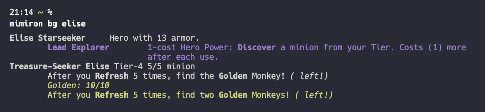

# Mimiron

An overengineered CLI tool to look up Hearthstone cards. It feeds up on the official Blizzard API and therefore, in theory, always works and always has the official, and updated, data for all cards.


## Installation

You need to have Rust installed on your system. You can then fork this repositry and install the app on your machine with.

```sh
cargo install --path .
```

However, you need your Blizzard API credentials as environment variables under `BLIZZARD_CLIENT_ID` and `BLIZZARD_CLIENT_SECRET`.

## Usage

You can look up a card with:

```sh
mimiron card Ragnaros
```

If the text you're looking up includes spaces or apostrophes they need to be in quotation marks (or the shell trips up), or you can escape them.

```sh
mimiron card "Al'Akir"
```

```sh
mimiron card Ace\ Hunter
```

You can also search in card text boxes (which is the default mode for Blizzard's API).

```sh
mimiron card ragnaros -t
```


You can look up a deck with:

```
mimiron deck AAECAa0GCOWwBKi2BJfvBO+RBeKkBf3EBc/GBcbHBRCi6AOEnwShtgSktgSWtwT52wS43AS63ASGgwXgpAW7xAW7xwX7+AW4ngbPngbRngYAAQO42QT9xAX/4QT9xAXFpQX9xAUAAA==

```


You can also compare two decks.

```sh
mimiron deck -c AAECAa0GCoSfBOWwBKi2BP/hBJfvBO+RBeKkBf3EBc/GBc2eBg+i6AOhtgSktgSWtwT52wS43AS63ASGgwXgpAW7xAW7xwX7+AW4ngbPngbRngYA AAECAa0GCKG2BKi2BOy6BO+RBc/GBc/2Bdj2Ba//BQv52wS43AS63ASGgwWkkQXgpAW7xwWm8QXt9wXjgAa4ngYA
```


You can look up Battlegrounds minions and Heroes

```sh
mimiron bg "N'zoth"
```



## Roadmap

The next item on the agenda is to create a command to add Sideboard cards to a deck. Deck code retrieved from HSReplay, D0nkey, or HearthstoneTopDecks lack the Sideboard data, and I want a simple tool to add them and get an updated code.

Also I want to include search for Duels treasures.

## License

MIT license. Don't care what you do with this, but give credit.

## Contribute

Suggestions and help welcome.

Please play around with it, abuse it, and let me know you things should work.