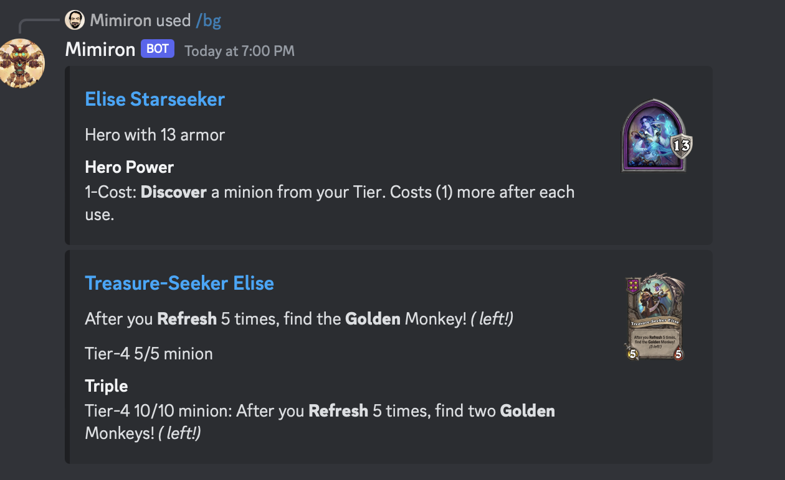

# Mimiron Discord Bot

An overengineered Discord Bot to look up Hearthstone cards. It feeds up on the official Blizzard API and therefore, in theory, always works and always has the official, and updated, data for all cards. All links take you to [PlayHearthstone.com](https://playhearthstone.com/en-us/cards/).


## Invitation

To invite the bot to your Discord server, use this [Invite Bot Link](https://discord.com/api/oauth2/authorize?client_id=1105550158969716857&permissions=0&scope=bot). The bot uses slash commands so it does not need any permissions.

As an alternative, I set up a small discord server to host the bot and play with it. You can join the [Mimiron Bot Server](https://discord.gg/HyW3nEMZKH), play with the bot, then invite it in-discord to your server.

## Usage

There are other commands not covered here. Join the bot's server and experiment!

### Card Lookup

Look up a card:

```sh
/card ragnaros
```


Include card text boxes in search (which is the default mode for Blizzard's API):

```sh
/cardtext deal 6 damage
```


Search for non-collectible cards. Note that this might include a lot of weird results.

```sh
/allcards the azerite
```


### Deck Lookup

Look up a deck: (also availble when right-clicking any message with a Deck Code)

```sh
/deck AAECAa0GCOWwBKi2BJfvBO+RBeKkBf3EBc/GBcbHBRCi6AOEnwShtgSktgSWtwT52wS43AS63ASGgwXgpAW7xAW7xwX7+AW4ngbPngbRngYAAQO42QT9xAX/4QT9xAXFpQX9xAUAAA==
```


You can also paste directly from the Hearthstone client, and it picks up on the deck title, _and_ it (mostly) works for Duels.

```sh
/deck ### Duels Deck # Class: Shaman # Format: Wild # # 1x (1) Cold Storage # 1x (1) Corrupt the Waters # 1x (1) Fire Fly # 1x (1) Frost Shock # 1x (1) Glacial Shard # 1x (1) Windchill # 1x (2) Bolner Hammerbeak # 1x (2) Fire Plume Harbinger # 1x (2) Sleetbreaker # 1x (3) Brilliant Macaw # 1x (3) Snowball Fight! # 1x (4) Granite Forgeborn # 1x (5) Living Prairie # 1x (7) Kalimos, Primal Lord # 1x (7) Skarr, the Catastrophe # 1x (8) Elemental Chaos # AAEBAaaPBRDLB5PBAuvCAvPCAuGoA8D2A4b6A9OABKeRBJWSBNySBPyABemjBb6PBsCPBtOeBgAAAA== # # To use this deck, copy it to your clipboard and create a new deck in Hearthstone
```


Note re-Duels: Limitations on duels are mostly because of shortcomings in Blizzard's API. Some treasures are not available in the API at all, and links to the official deckbuilder will not work as expected.

You can also compare two decks:

```sh
/deckcomp code1: AAEBAZ8FCr2GA86HA/voA8j5A+CLBMDiBP3EBZX1BfiUBs6cBgqzA9wK+NICkeQDyaAEmY4G444GvI8G9ZUG0Z4GAAEDiLED/cQFwOIE/cQFo+8E/cQFAAA= code2: AAEBAZ8FCL2GA86HA/voA5HsA+WwBP3EBY6VBp2iBguzA9wK2f4CzOsD2tkEwOIElo4GmY4G444GvI8G9ZUGAAED+7AD/cQFiLED/cQFo+8E/cQFAAA=
```


Feedback on how to improve the formatting is welcome. Some of the card images are sadly missing from Blizzard's API and are instead acquired from https://hearthstonejson.com 

### Battlegrounds Lookup

Look up Battlegrounds minions and Heroes:

```sh
/bg elise
```



Look up cards by tier and, optioanlly, minion type:

```sh
/bgtier tier: 1 minion_type: beast
```


Or look up cards by text:

```sh
/bgtext Wheel of Yogg-Saron
```


## Roadmap

Feedback is welcome either here in Github issues or in the [Mimiron Bot Server](https://discord.gg/HyW3nEMZKH) (where you can also try bot!!). No current specific thing planned.

## License

MIT license. Don't care what you do with this, but give credit.

## Contribute

Suggestions and help welcome.

Please play around with it, abuse it, and let me know you things should work.
