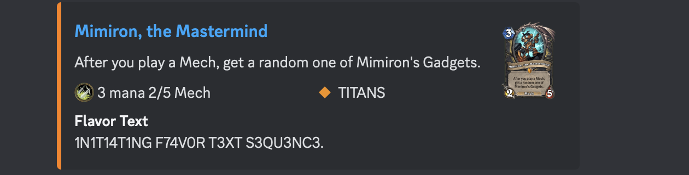

# Mimiron Discord Bot

An overengineered Discord Bot to look up Hearthstone cards. It feeds up on the official Blizzard API and therefore, in theory, always works and always has the official, and updated, data for all cards. All links take you to [PlayHearthstone.com](https://playhearthstone.com/en-us/cards/).



## Invitation

To invite the bot to your Discord server, use this [Invite Bot Link](https://discord.com/api/oauth2/authorize?client_id=1105550158969716857&permissions=0&scope=bot). The bot uses slash commands so it does not need any permissions.

As an alternative, I set up a small discord server to host the bot and play with it. You can join the [Mimiron Bot Server](https://discord.gg/HyW3nEMZKH), play with the bot, then invite it in-discord to your server.

## Usage

**Note:** The bot currently restricts itself to showing three cards to avoid overwhelming the chat more than it does now.

### Card Lookup

Look up a card:

```sh
/card ragnaros
```


Include card text boxes in search (which is the default mode for Blizzard's API):

```sh
/cardtext ragnaros
```


may be useful for Classic Cards (rip classic mode).

```sh
/cardreprints ragnaros
```


### Deck Lookup

Look up a deck:

```sh
/deck AAECAa0GCOWwBKi2BJfvBO+RBeKkBf3EBc/GBcbHBRCi6AOEnwShtgSktgSWtwT52wS43AS63ASGgwXgpAW7xAW7xwX7+AW4ngbPngbRngYAAQO42QT9xAX/4QT9xAXFpQX9xAUAAA==
```


This also handles Duels mode dual-class deck *mostly* correctly. (It doesn't edit the class name dynamically. Also the link to Blizzard's website will not work.)

```sh
/deck AAEBAa6aBQ/6Du/3ApXNA5PQA6bvA/D2A+CLBMeyBN65BJzHBJbUBJ+kBeKkBc+eBrChBgAAAA==
```


I am looking for feedback on how best to format the deck output. There are different ways to format/shape the image (you can see examples of which on the [main repo's README](../README.md)). Should I use those or use a text output? 

### Battlegrounds Lookup

Look up Battlegrounds minions and Heroes:

```sh
/battlegrounds elise
```


Looking up cards by tier and/or type is planned, but not currently implemented.

## Roadmap

Please use the bot and give me feedback, either here in Github issues or in the [Mimiron Bot Server](https://discord.gg/HyW3nEMZKH) (where you can also try bot!!) Some ideas include:
- Search for tokens, noncollectible cards
- Mercenaries support???

## License

MIT license. Don't care what you do with this, but give credit.

## Contribute

Suggestions and help welcome.

Please play around with it, abuse it, and let me know you things should work.